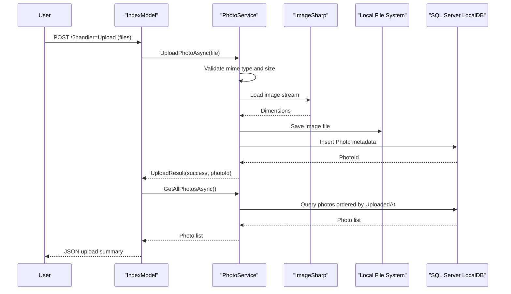

# API & Service Communication Contracts

This document summarizes the PhotoAlbum API surface exposed through Razor Page handlers and the synchronous service interactions behind those handlers.

## Service Catalog

| Service | Port | Category | Purpose |
|---|---|---|---|
| PhotoAlbum Web App | 5134 (HTTP), 7055 (HTTPS) | API Layer | Serves gallery UI, upload, detail, and file retrieval flows |

## API Endpoints Inventory

| Service | Method | Path | Request Type | Response Type |
|---|---|---|---|---|
| PhotoAlbum Web App | GET | `/` | None | Razor Page (gallery view) |
| PhotoAlbum Web App | POST | `/?handler=Upload` | `multipart/form-data` list of `IFormFile` | JSON payload with uploaded and failed files |
| PhotoAlbum Web App | GET | `/Detail?id={id}` | Query parameter `id` | Razor Page (photo details) |
| PhotoAlbum Web App | POST | `/Detail?handler=Delete&id={id}` | Form post with `id` | Redirect to `/Index` |
| PhotoAlbum Web App | GET | `/PhotoFile?id={id}` | Query parameter `id` | Binary file with stored MIME type |

## Management & Observability Endpoints

| Service | Endpoint | Custom Metrics (if any) |
|---|---|---|
| PhotoAlbum Web App | No explicit health/metrics endpoint configured | None detected |

## DTOs & Contracts

The API contract is handler-based rather than controller DTO-centric. `Photo` is used as the response model for Razor page rendering, while upload responses are anonymous JSON objects containing success metadata and error details. `UploadResult` acts as an internal contract between page handlers and `PhotoService` for upload outcomes. No OpenAPI or protobuf contracts were found.

## Communication Patterns

All interactions are synchronous in-process calls from Razor Page models to `IPhotoService`, then to EF Core and local file storage. No asynchronous messaging, circuit breaker, or retry frameworks were detected. Service discovery and gateway aggregation are not applicable because the solution is a single deployable web app. Startup order is local process initialization (directory check, migration execution) and does not depend on external services. Security posture: HTTPS redirection is enabled, but no authentication or authorization rules are configured; application endpoints are publicly accessible.

## Service Technology Matrix

| Service | Web | Data Access | Discovery | Gateway | Actuator | Cache | Metrics |
|---|---|---|---|---|---|---|---|
| PhotoAlbum Web App | Razor Pages | EF Core SQL Server | None | None | None | File cache headers only | Standard ASP.NET logging |

## Service Communication Sequence

