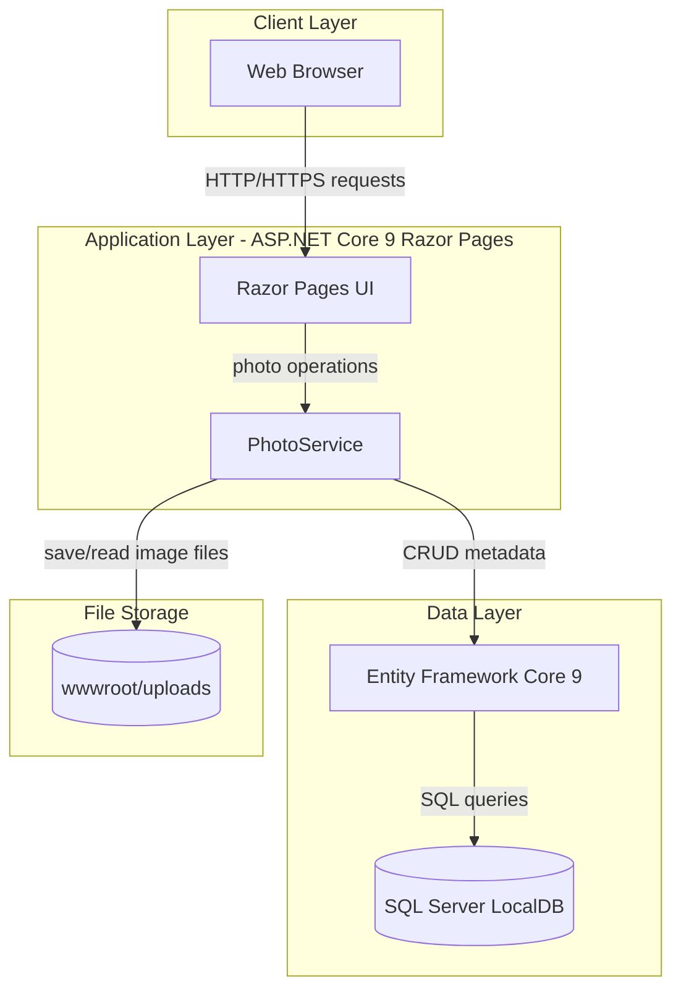
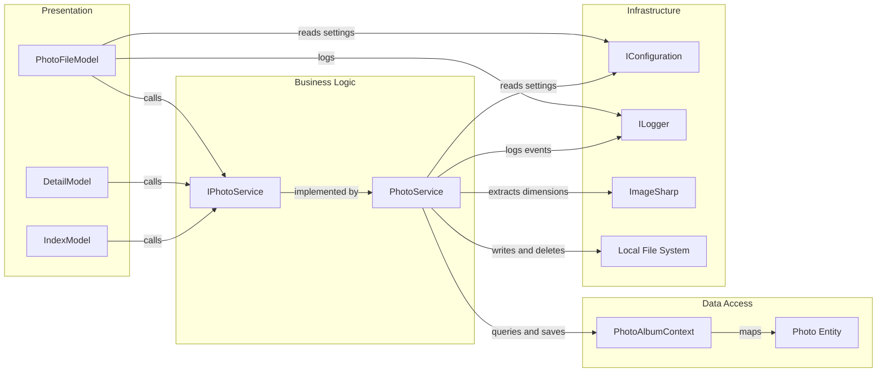

# Architecture Diagram

This document summarizes the PhotoAlbum application structure and key component interactions.

## Application Architecture

### Technology Stack Summary

| Layer | Technology | Version | Purpose |
|---|---|---|---|
| Presentation | ASP.NET Core Razor Pages | 9.0 | Web UI and request handling |
| Business | PhotoService | N/A | Upload, retrieval, and deletion workflows |
| Data Access | Entity Framework Core SQL Server provider | 9.0.9 | ORM and persistence |
| Storage | SQL Server LocalDB + local file system | LocalDB / N/A | Metadata and image binary storage |

### Data Storage & External Services

The application stores photo metadata in SQL Server LocalDB through EF Core and stores uploaded image files on local disk under `wwwroot/uploads`. No external APIs, queues, or third-party services were identified.

### Key Architectural Decisions

- Uses a service abstraction (`IPhotoService`) to separate page handlers from storage and validation logic.
- Persists metadata and file binaries in separate stores (database + file system) for efficient image serving.
- Applies migrations at startup outside test mode to keep schema aligned with the running app.

## Component Relationships

### Component Inventory

| Component | Layer | Type | Responsibility |
|---|---|---|---|
| IndexModel | Presentation | Razor PageModel | Loads gallery and handles multi-file upload requests |
| DetailModel | Presentation | Razor PageModel | Displays single photo details and delete action |
| PhotoFileModel | Presentation | Razor PageModel | Serves binary photo content by photo ID |
| IPhotoService | Business Logic | Service interface | Defines photo operations contract |
| PhotoService | Business Logic | Service implementation | Validates, stores, retrieves, and deletes photo data |
| PhotoAlbumContext | Data Access | EF Core DbContext | Manages `Photos` table and mappings |
| Photo | Data Access | Entity | Represents persisted photo metadata |
