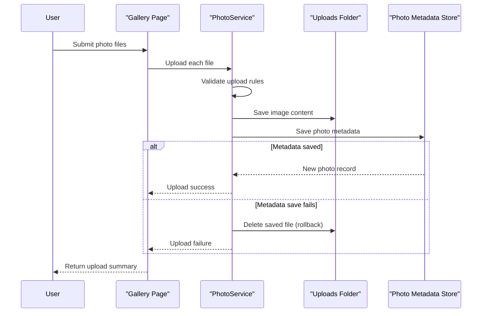

# Core Business Workflows

This application supports end users uploading, viewing, and deleting photos in a gallery experience, while maintaining photo metadata consistency between storage layers.

## Domain Entities

| Entity | Service / Bounded Context | Description | Key Relationships |
|---|---|---|---|
| Photo | Photo Management | Represents a user-uploaded image and metadata used in gallery and detail views | Used by upload, list, detail, file retrieval, and delete workflows |
| UploadResult | Photo Management | Internal outcome contract for upload operations (success/failure + identifiers/errors) | Bridges service operations and page handler responses |

## Service-to-Domain Mapping

| Service | Domain Context | Owned Entities | External Dependencies |
|---|---|---|---|
| Razor Page Models (Index, Detail, PhotoFile) | Gallery Interaction | Photo view models and page response contracts | `IPhotoService` |
| PhotoService | Photo Management | Photo, UploadResult | EF Core context, local file system, ImageSharp |
| PhotoAlbumContext | Persistence | Photo table mapping | SQL Server LocalDB |

## Primary Workflows

### Workflow 1: Upload Photos to Gallery

User submits one or more files from the gallery page. For each file, the system validates format and size, extracts image dimensions, writes the file to uploads storage, then persists metadata. If persistence fails, the written file is removed to preserve consistency. Successful and failed uploads are returned in one JSON response.

### Workflow 2: View Photo Details and Navigate

User opens a detail view by photo ID. The system loads all photos in chronological order, resolves the selected item, and computes adjacent photo IDs for next/previous navigation.

### Workflow 3: Delete Photo

User triggers delete from the detail page. The service removes the physical file if present, removes metadata from the database, and redirects to the gallery.

## Cross-Service Data Flows

The application is single-service, so no inter-service aggregation is required. Data flow composes file-system state (binary content) with database state (metadata) inside the service layer. If database save fails after file write, the compensating deletion path prevents orphaned files and preserves business consistency.

## Business Workflow Sequence

## Business Rules & Decision Logic

- Accept only configured image MIME types (jpeg, png, gif, webp).
- Reject files exceeding configured upload size or empty files.
- Maintain dual-storage consistency by removing files when metadata persistence fails.
- Keep gallery ordering by upload timestamp descending to prioritize newest content.
- Deletion tolerates missing physical files while still removing metadata to preserve user-visible state.
