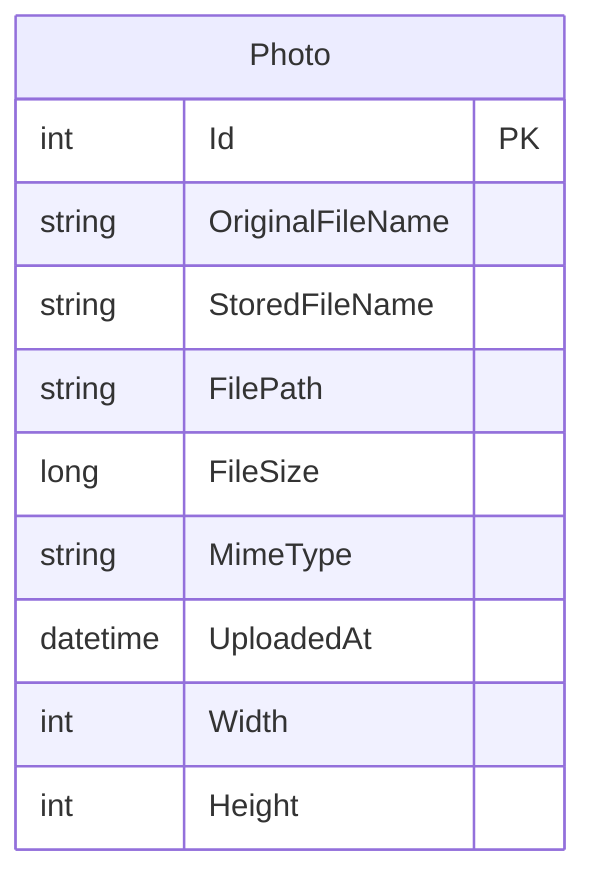

# Data Architecture & Persistence Layer

This document summarizes the PhotoAlbum persistence layer, which uses EF Core with SQL Server LocalDB for metadata and local disk for image binaries.

## Database Configuration

| Service/Module | DB Type | Profile | Driver | Connection | Migration Tool |
|---|---|---|---|---|---|
| PhotoAlbum | SQL Server LocalDB | Development/default | Microsoft.EntityFrameworkCore.SqlServer | LocalDB connection string from appsettings | EF Core migrations (`Database.MigrateAsync`) |
| PhotoAlbum.Tests | In-memory database | Test | Microsoft.EntityFrameworkCore.InMemory | In-process test database | Test setup seeding (no migration tool) |

## Data Ownership per Service

| Service | Tables Owned | ORM Framework | Caching | Notes |
|---|---|---|---|---|
| PhotoAlbum | Photos | EF Core | Browser/static-file cache headers | Single table for photo metadata; binary file stored separately |

## Entity Model

## Key Repository Methods

| Service | Repository | Notable Methods | Purpose |
|---|---|---|---|
| PhotoAlbum | `PhotoAlbumContext` (`DbSet<Photo>`) | `Photos.OrderByDescending(...).ToListAsync()` | Fetch gallery in reverse chronological order |
| PhotoAlbum | `PhotoAlbumContext` (`DbSet<Photo>`) | `Photos.FindAsync(id)` | Resolve photo metadata by identifier |
| PhotoAlbum | `PhotoAlbumContext` (`DbSet<Photo>`) | `Photos.AddAsync(photo)` + `SaveChangesAsync()` | Persist upload metadata |
| PhotoAlbum | `PhotoAlbumContext` (`DbSet<Photo>`) | `Photos.Remove(photo)` + `SaveChangesAsync()` | Remove metadata on photo deletion |

## Caching Strategy

The application does not use an explicit distributed or in-memory cache provider. It applies HTTP cache headers for static/binary file responses (`Cache-Control`) and uses ETag generation in photo file responses to improve browser-side caching behavior.

## Data Ownership Boundaries

Data ownership is centralized in a single service and a single relational table (`Photos`). There are no cross-service data access patterns, shared databases across multiple services, or CQRS separation. Metadata writes and file writes are coordinated in service logic with rollback deletion of the physical file when database persistence fails.

### Data Classification & Sensitivity

| Entity | Sensitive Fields | Classification (PII/PHI/PCI/None) | Controls in Place |
|---|---|---|---|
| Photo | OriginalFileName (may contain personal naming), file content path metadata | PII (potential, low sensitivity) | No explicit encryption-at-rest or masking configured in code |

