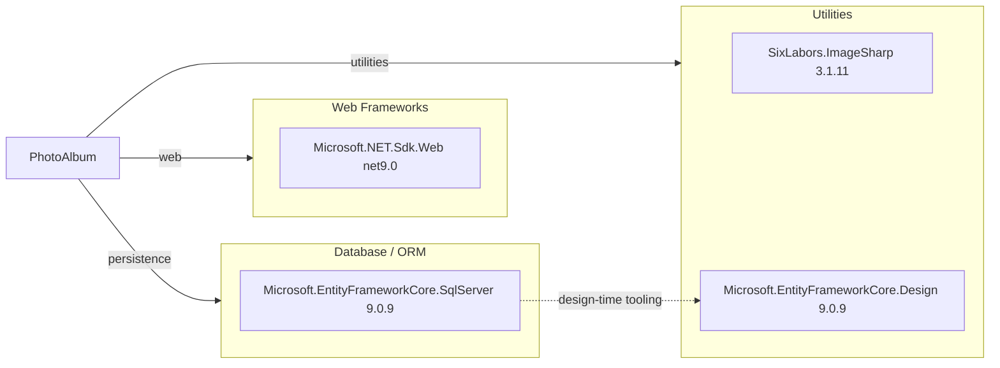

# Dependency Map

This document maps declared dependencies for PhotoAlbum (3 production dependencies and 6 test dependencies).

## Dependencies

### Dependency Summary

| Category | Count | Key Libraries | Notes |
|---|---:|---|---|
| Web Frameworks | 1 | Microsoft.NET.Sdk.Web | ASP.NET Core Razor Pages host |
| Database / ORM | 1 | Microsoft.EntityFrameworkCore.SqlServer 9.0.9 | SQL Server provider for EF Core |
| Utilities | 2 | SixLabors.ImageSharp 3.1.11, Microsoft.EntityFrameworkCore.Design 9.0.9 | Image processing + EF design-time tooling |

### Version & Compatibility Risks

The application targets `net9.0` (STS), while the requested modernization target is `net10.0`; upgrade planning should include framework retargeting and package compatibility checks. EF Core and ASP.NET dependencies are already aligned on 9.0.x, which lowers immediate internal version skew risk.

### Notable Observations

- Dependency footprint is intentionally small, which simplifies upgrade and security review.
- Image processing relies on a single external utility package (ImageSharp), limiting migration blast radius.
- EF Core design package is marked private assets and does not affect runtime deployment.

## Test Dependencies

| Framework | Version | Notes |
|---|---|---|
| xunit | 2.9.2 | Primary test framework |
| xunit.runner.visualstudio | 2.8.2 | Test discovery and execution in IDE/CLI |
| Microsoft.NET.Test.Sdk | 17.12.0 | Test host infrastructure |
| Microsoft.AspNetCore.Mvc.Testing | 9.0.9 | Web integration test hosting |
| Microsoft.EntityFrameworkCore.InMemory | 9.0.9 | In-memory provider for isolated tests |
| coverlet.collector | 6.0.2 | Code coverage data collector |

Total test-scope dependencies: 6
The test stack covers unit and integration scenarios with in-memory persistence, suitable for fast validation of service behavior.
