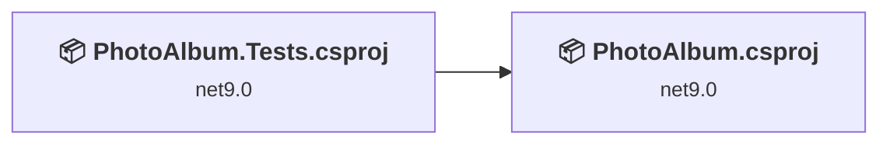
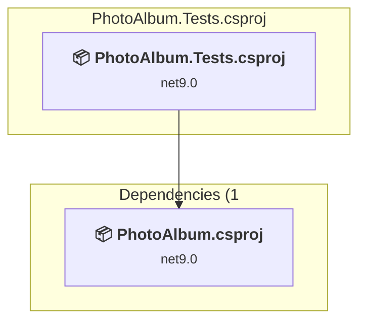
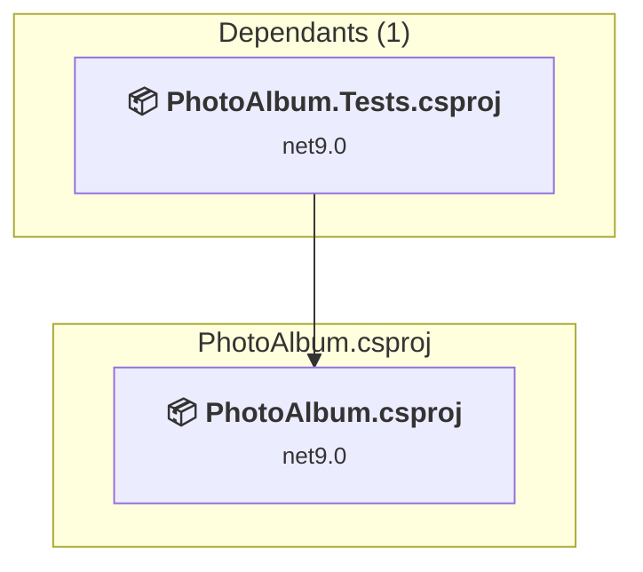

# Projects and dependencies analysis

This document provides a comprehensive overview of the projects and their dependencies in the context of upgrading to .NETCoreApp,Version=v10.0.

## Table of Contents

- [Executive Summary](#executive-Summary)
  - [Highlevel Metrics](#highlevel-metrics)
  - [Projects Compatibility](#projects-compatibility)
  - [Package Compatibility](#package-compatibility)
  - [API Compatibility](#api-compatibility)
  - [Binding Redirect Configuration](#binding-redirect-configuration)
- [Aggregate NuGet packages details](#aggregate-nuget-packages-details)
- [Top API Migration Challenges](#top-api-migration-challenges)
  - [Technologies and Features](#technologies-and-features)
  - [Most Frequent API Issues](#most-frequent-api-issues)
- [Projects Relationship Graph](#projects-relationship-graph)
- [Project Details](#project-details)

  - [PhotoAlbum.Tests\PhotoAlbum.Tests.csproj](#photoalbumtestsphotoalbumtestscsproj)
  - [PhotoAlbum\PhotoAlbum.csproj](#photoalbumphotoalbumcsproj)

## Executive Summary

### Highlevel Metrics

| Metric | Count | Status |
| :--- | :---: | :--- |
| Total Projects | 2 | All require upgrade |
| Total NuGet Packages | 9 | 5 need upgrade |
| Total Code Files | 24 |  |
| Total Code Files with Incidents | 4 |  |
| Total Lines of Code | 1651 |  |
| Total Number of Issues | 11 |  |
| Estimated LOC to modify | 4+ | at least 0.2% of codebase |

### Projects Compatibility

| Project | Target Framework | Difficulty | Package Issues | API Issues | Binding Issues | Est. LOC Impact | Description |
| :--- | :---: | :---: | :---: | :---: | :---: | :---: | :--- |
| [PhotoAlbum.Tests\PhotoAlbum.Tests.csproj](#photoalbumtestsphotoalbumtestscsproj) | net9.0 | 🟢 Low | 3 | 0 | 0 |  | DotNetCoreApp, Sdk Style = True |
| [PhotoAlbum\PhotoAlbum.csproj](#photoalbumphotoalbumcsproj) | net9.0 | 🟢 Low | 2 | 4 | 0 | 4+ | AspNetCore, Sdk Style = True |

### Package Compatibility

| Status | Count | Percentage |
| :--- | :---: | :---: |
| ✅ Compatible | 4 | 44.4% |
| ⚠️ Incompatible | 1 | 11.1% |
| 🔄 Upgrade Recommended | 4 | 44.4% |
| ***Total NuGet Packages*** | ***9*** | ***100%*** |

### API Compatibility

| Category | Count | Impact |
| :--- | :---: | :--- |
| 🔴 Binary Incompatible | 3 | High - Require code changes |
| 🟡 Source Incompatible | 0 | Medium - Needs re-compilation and potential conflicting API error fixing |
| 🔵 Behavioral change | 1 | Low - Behavioral changes that may require testing at runtime |
| ✅ Compatible | 1450 |  |
| ***Total APIs Analyzed*** | ***1454*** |  |

## Aggregate NuGet packages details

| Package | Current Version | Suggested Version | Projects | Description |
| :--- | :---: | :---: | :--- | :--- |
| coverlet.collector | 6.0.2 |  | [PhotoAlbum.Tests.csproj](#photoalbumtestsphotoalbumtestscsproj) | ✅Compatible |
| Microsoft.AspNetCore.Mvc.Testing | 9.0.9 | 10.0.9 | [PhotoAlbum.Tests.csproj](#photoalbumtestsphotoalbumtestscsproj) | NuGet package upgrade is recommended |
| Microsoft.EntityFrameworkCore.Design | 9.0.9 | 10.0.9 | [PhotoAlbum.csproj](#photoalbumphotoalbumcsproj) | NuGet package upgrade is recommended |
| Microsoft.EntityFrameworkCore.InMemory | 9.0.9 | 10.0.9 | [PhotoAlbum.Tests.csproj](#photoalbumtestsphotoalbumtestscsproj) | NuGet package upgrade is recommended |
| Microsoft.EntityFrameworkCore.SqlServer | 9.0.9 | 10.0.9 | [PhotoAlbum.csproj](#photoalbumphotoalbumcsproj) | NuGet package upgrade is recommended |
| Microsoft.NET.Test.Sdk | 17.12.0 |  | [PhotoAlbum.Tests.csproj](#photoalbumtestsphotoalbumtestscsproj) | ✅Compatible |
| SixLabors.ImageSharp | 3.1.11 |  | [PhotoAlbum.csproj](#photoalbumphotoalbumcsproj) | ✅Compatible |
| xunit | 2.9.2 |  | [PhotoAlbum.Tests.csproj](#photoalbumtestsphotoalbumtestscsproj) | ⚠️NuGet package is deprecated |
| xunit.runner.visualstudio | 2.8.2 |  | [PhotoAlbum.Tests.csproj](#photoalbumtestsphotoalbumtestscsproj) | ✅Compatible |

## Top API Migration Challenges

### Technologies and Features

| Technology | Issues | Percentage | Migration Path |
| :--- | :---: | :---: | :--- |

### Most Frequent API Issues

| API | Count | Percentage | Category |
| :--- | :---: | :---: | :--- |
| M:Microsoft.Extensions.Configuration.ConfigurationBinder.Get''1(Microsoft.Extensions.Configuration.IConfiguration) | 2 | 50.0% | Binary Incompatible |
| M:Microsoft.AspNetCore.Builder.ExceptionHandlerExtensions.UseExceptionHandler(Microsoft.AspNetCore.Builder.IApplicationBuilder,System.String) | 1 | 25.0% | Behavioral Change |
| M:Microsoft.Extensions.Configuration.ConfigurationBinder.GetValue''1(Microsoft.Extensions.Configuration.IConfiguration,System.String) | 1 | 25.0% | Binary Incompatible |

## Projects Relationship Graph

Legend:
📦 SDK-style project
⚙️ Classic project

## Project Details

### PhotoAlbum.Tests\PhotoAlbum.Tests.csproj

#### Project Info

- **Current Target Framework:** net9.0
- **Proposed Target Framework:** net10.0
- **SDK-style**: True
- **Project Kind:** DotNetCoreApp
- **Dependencies**: 1
- **Dependants**: 0
- **Number of Files**: 3
- **Number of Files with Incidents**: 1
- **Lines of Code**: 230
- **Estimated LOC to modify**: 0+ (at least 0.0% of the project)

#### Dependency Graph

Legend:
📦 SDK-style project
⚙️ Classic project

### API Compatibility

| Category | Count | Impact |
| :--- | :---: | :--- |
| 🔴 Binary Incompatible | 0 | High - Require code changes |
| 🟡 Source Incompatible | 0 | Medium - Needs re-compilation and potential conflicting API error fixing |
| 🔵 Behavioral change | 0 | Low - Behavioral changes that may require testing at runtime |
| ✅ Compatible | 397 |  |
| ***Total APIs Analyzed*** | ***397*** |  |

### PhotoAlbum\PhotoAlbum.csproj

#### Project Info

- **Current Target Framework:** net9.0
- **Proposed Target Framework:** net10.0
- **SDK-style**: True
- **Project Kind:** AspNetCore
- **Dependencies**: 0
- **Dependants**: 1
- **Number of Files**: 31
- **Number of Files with Incidents**: 3
- **Lines of Code**: 1421
- **Estimated LOC to modify**: 4+ (at least 0.3% of the project)

#### Dependency Graph

Legend:
📦 SDK-style project
⚙️ Classic project

### API Compatibility

| Category | Count | Impact |
| :--- | :---: | :--- |
| 🔴 Binary Incompatible | 3 | High - Require code changes |
| 🟡 Source Incompatible | 0 | Medium - Needs re-compilation and potential conflicting API error fixing |
| 🔵 Behavioral change | 1 | Low - Behavioral changes that may require testing at runtime |
| ✅ Compatible | 1053 |  |
| ***Total APIs Analyzed*** | ***1057*** |  |

