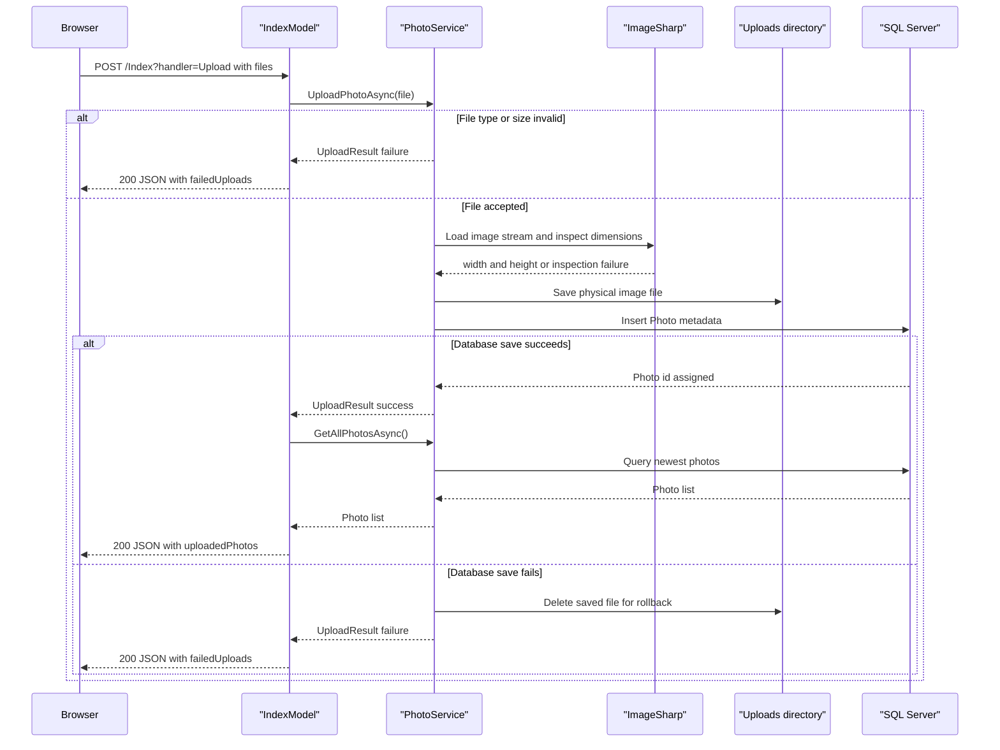

# API & Service Communication Contracts

The repository exposes a small HTTP surface centered on Razor Pages plus one JSON upload handler and one binary photo endpoint. Communication is entirely synchronous and in-process: browser requests hit page handlers, which call a scoped service and then local storage and SQL persistence.

## Service Catalog

| Service | Port | Category | Purpose |
|---|---|---|---|
| `PhotoAlbum` | `5134` HTTP and `7055` HTTPS in local launch settings; `8080` in the container definition | API Layer | Serves gallery pages, upload/delete handlers, and indirect photo file delivery from a single ASP.NET Core process |

## API Endpoints Inventory

| Service | Method | Path | Request Type | Response Type |
|---|---|---|---|---|
| `PhotoAlbum` | GET | `/` | None | HTML gallery page populated from `List<Photo>` |
| `PhotoAlbum` | POST | `/Index?handler=Upload` | `multipart/form-data` with repeated `files` values mapped to `List<IFormFile>` | JSON object with `success`, `uploadedPhotos[]`, and `failedUploads[]`; returns `400` when no files are provided |
| `PhotoAlbum` | GET | `/Detail/{id?}` | Path parameter `id:int?` | HTML detail page for one photo, or `404` if not found |
| `PhotoAlbum` | POST | `/Detail/{id?}?handler=Delete` | Path parameter `id:int`; antiforgery form post | Redirect to `/Index` on success, or redirect back to detail page with `TempData["Error"]` on failure |
| `PhotoAlbum` | GET | `/photo/{id:int}` | Path parameter `id:int` | Binary file response using the stored MIME type, or `404`/`500` |
| `PhotoAlbum` | GET | `/Privacy` | None | Static HTML page |
| `PhotoAlbum` | GET | `/Error` | None | HTML error page |

## Management & Observability Endpoints

| Service | Endpoint | Custom Metrics (if any) |
|---|---|---|
| `PhotoAlbum` | None detected in repository | None detected |

## DTOs & Contracts

The app does not define separate gateway contracts or external service DTOs because it is a single deployable web application. The main contract types visible in the repository are:

- `Photo`: service-level domain entity used by page models and views for gallery, detail, and file lookup flows. Field-level persistence details are documented in `data-architecture.md`.
- `UploadResult`: mutable service result object that carries upload success status, created photo id, original file name, and an optional error message.
- Anonymous JSON upload response shape from `IndexModel.OnPostUploadAsync`: contains `success`, `uploadedPhotos`, and `failedUploads`; this is the only explicit JSON API contract in the app.

No immutable C# records, OpenAPI documents, Swashbuckle setup, protobuf schemas, or GraphQL schemas were found. JSON serialization appears to use the default ASP.NET Core `JsonResult` pipeline, which implies the built-in `System.Text.Json` stack unless overridden elsewhere.

## Communication Patterns

All request handling is synchronous from the caller perspective: the browser invokes Razor Page routes, page handlers call `IPhotoService`, and `PhotoService` performs direct EF Core and file-system work inside the same process. There is no asynchronous messaging, no inter-service REST or gRPC communication, no API gateway, no service discovery, and no client-side load balancing in the repository.

No retry, circuit-breaker, timeout, or bulkhead libraries are configured. Startup order only matters insofar as the app creates the uploads directory and runs EF Core migrations before it begins serving requests; request availability therefore depends on SQL connectivity at startup. Security posture is minimal: HTTPS redirection is enabled, HSTS is enabled outside development, upload and delete forms include antiforgery tokens, but no authentication or authorization is configured, so all routes are effectively public.

## Service Technology Matrix

| Service | Web | Data Access | Discovery | Gateway | Actuator | Cache | Metrics |
|---|---|---|---|---|---|---|---|
| `PhotoAlbum` | Razor Pages | EF Core with SQL Server provider | None | None | None | None | None |

## Service Communication Sequence

