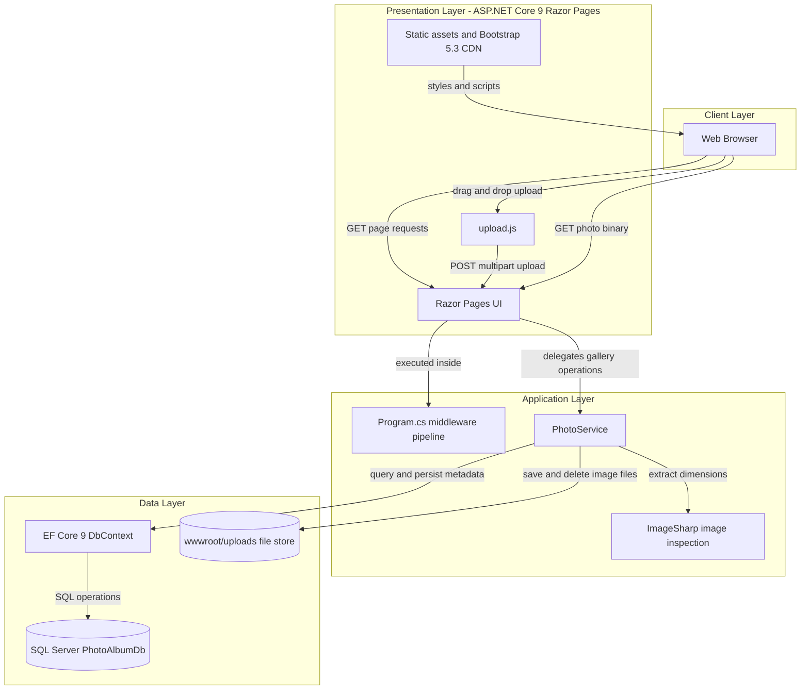
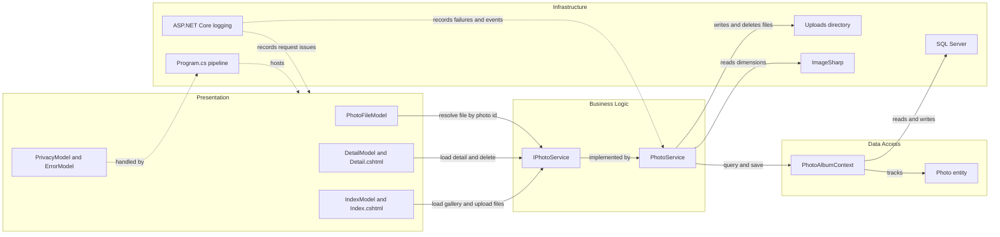

# Architecture Diagram

PhotoAlbum is a single deployable ASP.NET Core 9 Razor Pages application. The repository shows a classic monolithic web app where Razor Pages call an in-process photo service that persists metadata to SQL Server and stores image binaries on the local file system.

## Application Architecture

### Technology Stack Summary

| Layer | Technology | Version | Purpose |
|---|---|---:|---|
| Presentation | ASP.NET Core Razor Pages | 9.0 | Server-rendered UI and Razor Page handlers |
| Presentation | JavaScript upload client | Repository source | Drag-and-drop multi-file upload and JSON response handling |
| Presentation | Bootstrap via CDN | 5.3.0 | Layout and responsive styling |
| Application | Custom `PhotoService` | Repository source | Upload, retrieval, metadata extraction, and deletion orchestration |
| Persistence | Entity Framework Core with SQL Server provider | 9.0.9 | ORM and database access |
| Storage | SQL Server LocalDB / SQL Server | Repository config | Stores photo metadata |
| Storage | Local file system under `wwwroot/uploads` | Repository config | Stores uploaded image binaries |
| Utility | SixLabors.ImageSharp | 3.1.11 | Reads image dimensions during upload |

### Data Storage & External Services

The running application uses two storage mechanisms: SQL Server stores photo metadata through EF Core, and `wwwroot/uploads` stores the actual image files. No cache, message broker, or outbound API integration is implemented in the application code; Azure deployment files exist in the repo, but the app logic itself remains a single-process web application.

### Key Architectural Decisions

- Uses a simple monolithic structure: Razor Pages call an in-process `IPhotoService` implementation instead of separate APIs or background workers.
- Splits binary storage from metadata storage: image files are written to disk while photo metadata is persisted in SQL Server.
- Applies EF Core migrations during startup and creates the uploads directory before serving requests, making storage readiness part of application boot.

## Component Relationships

### Component Inventory

| Component | Layer | Type | Responsibility |
|---|---|---|---|
| `IndexModel` and `Index.cshtml` | Presentation | Razor Page and PageModel | Renders the gallery and handles multipart upload requests |
| `DetailModel` and `Detail.cshtml` | Presentation | Razor Page and PageModel | Displays one photo, metadata, navigation, and delete action |
| `PhotoFileModel` | Presentation | Razor Page handler | Returns the stored image bytes by photo id |
| `PrivacyModel` and `ErrorModel` | Presentation | Razor Pages | Static privacy page and error rendering |
| `IPhotoService` | Business Logic | Service contract | Defines gallery retrieval, upload, lookup, and delete operations |
| `PhotoService` | Business Logic | Scoped service | Validates uploads, extracts dimensions, coordinates file and database persistence, and deletes photos |
| `PhotoAlbumContext` | Data Access | EF Core DbContext | Exposes the `Photos` set and configures persistence metadata |
| `Photo` | Data Access | Entity | Represents persisted photo metadata and file location |
| `Program.cs` pipeline | Infrastructure | Startup and middleware | Configures DI, EF Core, static files, migrations, and Razor Pages routing |
| Uploads directory | Infrastructure | File storage | Stores the physical image files referenced by `Photo.StoredFileName` |
| SQL Server | Infrastructure | Database | Persists photo metadata rows |
| ImageSharp | Infrastructure | Library component | Reads image dimensions during upload processing |
