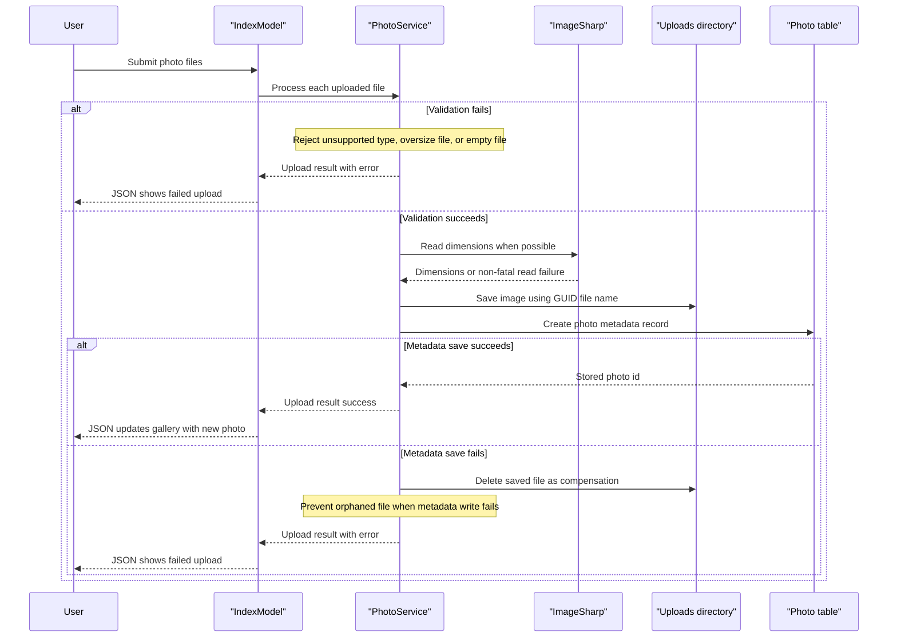

# Core Business Workflows

PhotoAlbum lets users maintain a simple photo gallery: they upload pictures, browse them chronologically, inspect metadata, and remove unwanted items. The repository’s business behavior is centered on keeping file-system storage and metadata persistence reasonably consistent during upload and delete operations.

## Domain Entities

| Entity | Service / Bounded Context | Description | Key Relationships |
|---|---|---|---|
| `Photo` | `PhotoAlbum` / Gallery Management | Represents a user-uploaded image plus the metadata needed to display and manage it | Participates in the gallery collection, detail view, delete flow, and indirect file-serving flow |
| Gallery collection | `PhotoAlbum` / Gallery Management | Ordered set of uploaded photos shown on the home page | Built from `Photo` records sorted newest first |
| Upload result | `PhotoAlbum` / Upload Processing | Outcome object used to report whether each attempted upload succeeded or failed | Connects upload validation and persistence outcomes back to the caller |

## Service-to-Domain Mapping

| Service | Domain Context | Owned Entities | External Dependencies |
|---|---|---|---|
| `PhotoAlbum` | Gallery Management and Upload Processing | `Photo`, gallery ordering, upload outcomes | SQL Server for metadata persistence, local uploads directory for image binaries, ImageSharp for dimension extraction |

## Primary Workflows

### Workflow 1: Upload photo files into the gallery

Entry point: the browser posts to `/Index?handler=Upload` after drag-and-drop or file selection.

1. `IndexModel.OnPostUploadAsync` receives a batch of uploaded files and rejects the request with `400` if no files are supplied.
2. Each file is passed to `PhotoService.UploadPhotoAsync`.
3. The service applies business validation rules: only JPEG, PNG, GIF, and WebP are accepted; file size must not exceed 10 MB; zero-length files are rejected.
4. For accepted files, the service generates a GUID-based storage name so the persisted file name is decoupled from the original upload name.
5. The service attempts to inspect image dimensions with ImageSharp; failure to read dimensions is treated as non-fatal.
6. The physical file is saved to the uploads directory.
7. Metadata is persisted as a `Photo` record with UTC timestamp, size, MIME type, and optional dimensions.
8. If database persistence fails after the file write, the service attempts a compensating delete of the saved file and returns a failure result.
9. `IndexModel` reloads gallery data for successful uploads and returns a JSON payload containing successful and failed items so the browser can update the gallery incrementally.

### Workflow 2: Browse the gallery and inspect one photo

Entry points: `GET /` and `GET /Detail/{id?}`.

1. `IndexModel.OnGetAsync` loads all photos through `GetAllPhotosAsync`.
2. The service returns photos in descending `UploadedAt` order, which becomes the gallery’s business ordering rule.
3. Selecting a photo opens `DetailModel.OnGetAsync`, which reloads the ordered list and finds the current item.
4. The detail page derives previous and next navigation targets from the same chronological ordering.
5. The detail view computes display-only values such as formatted file size and aspect ratio for the selected photo.

### Workflow 3: Delete a photo from the gallery

Entry point: delete form post from `/Detail/{id?}?handler=Delete`.

1. `DetailModel.OnPostDeleteAsync` invokes `DeletePhotoAsync`.
2. The service locates the `Photo` record by id.
3. It tries to remove the physical file first; file deletion errors are logged but do not block metadata deletion.
4. The service removes the database row and saves changes.
5. On success, the user is redirected to the gallery; on exception, the detail page is reopened with an error message in `TempData`.

## Cross-Service Data Flows

No cross-service or cross-module data flows were found because the repository is a single deployable application. All orchestration is in-process: page models call `PhotoService`, which coordinates local file storage and SQL metadata persistence directly. There is no gateway aggregation, downstream API composition, or circuit-breaker fallback path in the current implementation.

## Business Workflow Sequence

## Business Rules & Decision Logic

- **Validation rules**
  - Only `image/jpeg`, `image/png`, `image/gif`, and `image/webp` uploads are accepted.
  - Each uploaded file must be larger than zero bytes and no larger than `10 MB`.
  - The gallery UI advertises the same allowed types and size limit client-side before upload.
- **Decision logic**
  - Files are renamed with GUID-based storage names while retaining the original file name in metadata.
  - Gallery and detail navigation order is determined by descending upload timestamp.
  - Image dimension extraction is optional: the workflow continues even if ImageSharp cannot read the file.
- **State and integrity behavior**
  - Upload creates a new `Photo` record only after the file has been written.
  - If metadata persistence fails, the service deletes the just-written file as a compensating action.
  - Delete removes the file first when possible, then removes the metadata row.
- **Cross-cutting concerns**
  - There is no explicit transaction scope spanning file and database work; consistency is best-effort through compensating deletes.
  - Errors are logged through ASP.NET Core logging, and user-facing failures are returned as JSON upload errors or `TempData` messages on delete.
  - No business-level authorization rules are implemented; upload, browse, and delete flows are publicly reachable.
