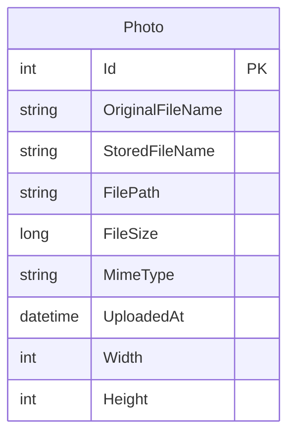

# Data Architecture & Persistence Layer

The data layer is intentionally small: one persisted entity is managed through Entity Framework Core, with SQL Server as the primary database provider and the local file system used for image bytes. Tests substitute the relational provider with EF Core InMemory to validate service behavior without a real database.

## Database Configuration

| Service/Module | DB Type | Profile | Driver | Connection | Migration Tool |
|---|---|---|---|---|---|
| `PhotoAlbum` | SQL Server LocalDB by default; Azure SQL compatible in deployment templates | Default and Development | `Microsoft.EntityFrameworkCore.SqlServer` 9.0.9 | `ConnectionStrings:DefaultConnection` from `appsettings.json`, overridden by `ConnectionStrings__DefaultConnection` in Azure Container Apps | EF Core migrations in `PhotoAlbum\Migrations`, executed at startup when `IsTestEnvironment` is false |
| `PhotoAlbum.Tests` | In-memory database | Test | `Microsoft.EntityFrameworkCore.InMemory` 9.0.9 | Per-test ephemeral database name created in code | None |

## Data Ownership per Service

| Service | Tables Owned | ORM Framework | Caching | Notes |
|---|---|---|---|---|
| `PhotoAlbum` | `Photos` | EF Core 9 | None | Database stores metadata only; image binaries are stored separately under `wwwroot/uploads` |

## Entity Model

## Key Repository Methods

No dedicated repository interfaces were found in the repository; `PhotoService` works directly against `PhotoAlbumContext` and its `Photos` set.

| Service | Repository | Notable Methods | Purpose |
|---|---|---|---|
| `PhotoAlbum` | `PhotoAlbumContext.Photos` in `PhotoAlbum\Data\PhotoAlbumContext.cs` | `OrderByDescending(p => p.UploadedAt).ToListAsync()` | Returns the gallery in newest-first order |
| `PhotoAlbum` | `PhotoAlbumContext.Photos` in `PhotoAlbum\Data\PhotoAlbumContext.cs` | `FindAsync(id)` | Retrieves one photo for detail display and file delivery |
| `PhotoAlbum` | `PhotoAlbumContext.Photos` in `PhotoAlbum\Data\PhotoAlbumContext.cs` | `AddAsync(photo)` plus `SaveChangesAsync()` | Persists newly uploaded photo metadata after the file write succeeds |
| `PhotoAlbum` | `PhotoAlbumContext.Photos` in `PhotoAlbum\Data\PhotoAlbumContext.cs` | `Remove(photo)` plus `SaveChangesAsync()` | Deletes photo metadata after delete orchestration starts |

## Caching Strategy

No application-level data cache, distributed cache, or ORM second-level cache is configured in the repository. The only cache-related behavior is HTTP response caching for static content: `Program.cs` adds `Cache-Control: public,max-age=3600` for static files, and `PhotoFileModel` returns long-lived browser caching headers plus an `ETag` for served image binaries. Those headers improve client-side asset reuse but do not introduce a persistence-layer cache.

## Data Ownership Boundaries

The repository implements a single application boundary, not multiple services. One app owns one logical data store for metadata (`Photos` in SQL Server) and one local file-store boundary for binary image content (`wwwroot/uploads`). All reads and writes flow through `PhotoService`; there is no cross-service database access, no shared database between independent deployables, and no CQRS split between write and read models.

During upload, persistence is coordinated in two steps: the binary file is written to disk, then the `Photo` row is inserted into SQL Server. If the database save fails, the service attempts a compensating delete of the saved file to reduce orphaned storage. Delete follows the reverse path: the service tries to delete the file and then removes the database row, continuing with database deletion even if file cleanup fails.

### Data Classification & Sensitivity

| Entity | Sensitive Fields | Classification (PII/PHI/PCI/None) | Controls in Place |
|---|---|---|---|
| `Photo` | `OriginalFileName`; associated uploaded image content stored on disk may contain personal imagery | PII | No encryption-at-rest, masking, or field-level access controls are configured in the repository |
