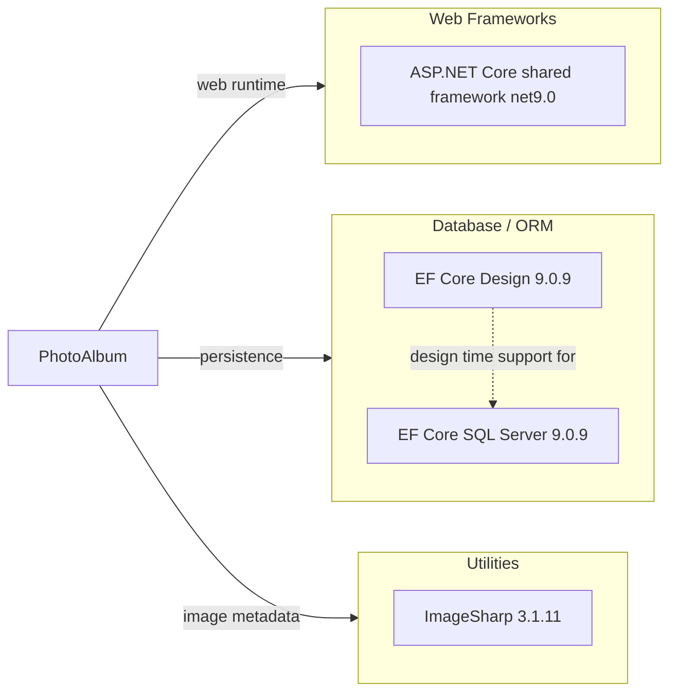

# Dependency Map

PhotoAlbum is a .NET 9 web application with three declared production dependencies in its app project plus a small, separate test toolchain. Most web framework functionality comes from the implicit ASP.NET Core shared framework provided by `Microsoft.NET.Sdk.Web`.

## Dependencies

### Dependency Summary

| Category | Count | Key Libraries | Notes |
|---|---:|---|---|
| Web Frameworks | 1 | ASP.NET Core shared framework net9.0 | Implicit from `Microsoft.NET.Sdk.Web`, not a `PackageReference` |
| Database / ORM | 2 | Microsoft.EntityFrameworkCore.SqlServer 9.0.9, Microsoft.EntityFrameworkCore.Design 9.0.9 | Runtime SQL Server access plus design-time migrations tooling |
| Utilities | 1 | SixLabors.ImageSharp 3.1.11 | Used to inspect uploaded image dimensions |

### Version & Compatibility Risks

No obviously obsolete production packages are declared in the repository. The main compatibility consideration is that the app targets .NET 9 and EF Core 9, so runtime, SDK, and EF package versions need to stay aligned; the web framework is also implicit through the Web SDK rather than pinned as an explicit package.

### Notable Observations

- The application has a very small declared dependency surface, which lowers library migration complexity.
- Web stack functionality is mostly supplied by the implicit ASP.NET Core shared framework, so package inventories alone understate the actual runtime stack.
- All persistence concerns flow through the SQL Server EF Core provider; no alternative database, cache, messaging, security, or observability libraries are declared.
- Image processing is isolated to a single utility package, `SixLabors.ImageSharp`.

## Test Dependencies

| Framework | Version | Notes |
|---|---:|---|
| xUnit | 2.9.2 | Primary unit test framework |
| xUnit Visual Studio runner | 2.8.2 | IDE and test host runner integration |
| Microsoft.NET.Test.Sdk | 17.12.0 | .NET test execution infrastructure |
| coverlet.collector | 6.0.2 | Code coverage data collector |
| Microsoft.AspNetCore.Mvc.Testing | 9.0.9 | ASP.NET Core test host utilities |
| Microsoft.EntityFrameworkCore.InMemory | 9.0.9 | In-memory provider used by service tests |

Total test-scope dependencies: 6

The test stack is conventional and intentionally separate from the production dependency set. Tests rely on EF Core InMemory rather than a real SQL Server instance, so persistence behavior is validated at a unit-test level rather than with full relational integration coverage.
